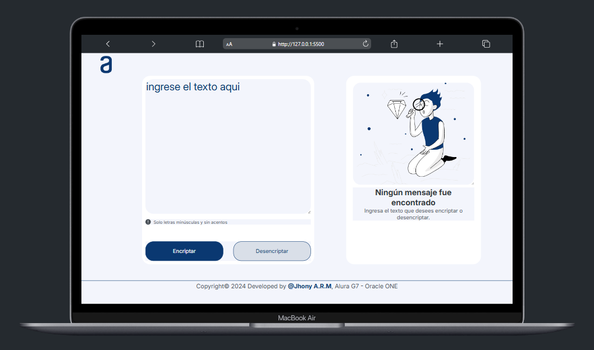
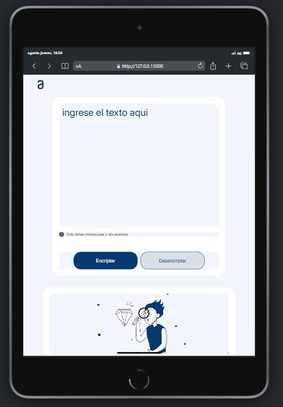
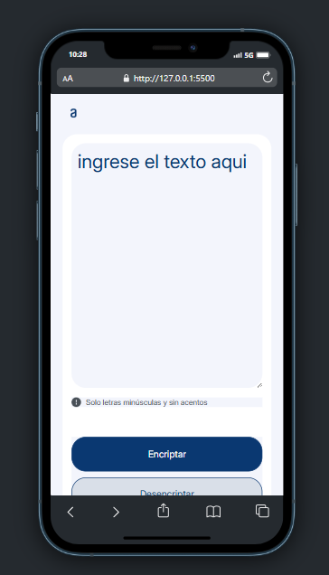

# Challenge Encriptador de Textos

## Responsividad

El **Challenge Encriptador de Textos** ha sido diseñado y desarrollado para ofrecer una experiencia de usuario fluida y consistente en una amplia gama de dispositivos. La interfaz es completamente **responsiva**, lo que garantiza que se adapte y funcione perfectamente en:

- **Desktop**: Optimizaciones para pantallas grandes con una interfaz expandida y fácil de usar.
- **Tablets**: Ajustes de diseño que aseguran una navegación cómoda y eficiente en dispositivos táctiles de tamaño medio.
- **Móviles**: Diseño compacto y accesible para garantizar una experiencia de usuario óptima en pantallas pequeñas.

## Descripción del Proyecto:

Bienvenido(a) al **Challenge Encriptador de Textos**, un proyecto final desarrollado como parte de la formación **Principiante en Programación G7 - ONE**, en colaboración con **Alura Latam** y **Oracle** a través del programa **BECA** **ONE (Oracle Next Education)**, orientado a quienes desean ingresar al área de Desarrollo Web.

Este proyecto tiene como objetivo aplicar y consolidar los conocimientos adquiridos en los Cursos de **Lógica de Programación, HTML, CSS y JavaScript**, a través de la creación de una aplicación web que permite **encriptar y desencriptar mensajes de texto**.

## Claves de Encriptación:

La aplicación utiliza un conjunto de reglas para transformar el texto ingresado:

- La letra **"e"** se convierte en **"enter"**.
- La letra **"i"** se convierte en **"imes"**.
- La letra **"a"** se convierte en **"ai"**.
- La letra **"o"** se convierte en **"ober"**.
- La letra **"u"** se convierte en **"ufat"**.

### Ejemplos:

- **Texto original:** "gato"
- **Texto encriptado:** "gaitober"

## Funcionamiento de la Aplicación:

### 1. Ingreso de Texto:

Al ingresar al sitio, encontrarás un cuadro de texto en la parte izquierda de la pantalla. Aquí es donde debes escribir el **mensaje que deseas encriptar o desencriptar**. **Recuerda:** El texto debe ser ingresado en minúsculas y sin acentos para que la encriptación funcione correctamente.

### 2. Proceso de Encriptación:

- **Encriptar:** 
  - Después de escribir el texto, al presionar el botón **"Encriptar"**, el área de la derecha se limpiará, eliminando cualquier imagen o mensaje anterior.
  - El texto encriptado aparecerá en el lado derecho junto con un botón **"Copiar"**.
  - Además, el área de la izquierda se limpiará, permitiéndote copiar y pegar el texto encriptado para utilizarlo nuevamente en la aplicación.

### 3. Proceso de Desencriptación:

- **Desencriptar:**
  - Pega el texto encriptado en el área de la izquierda y presiona el botón **"Desencriptar"**.
  - El texto desencriptado aparecerá en el lado derecho, listo para ser utilizado.

### 4. Copiado y Reutilización:

- Después de encriptar o desencriptar, utiliza el botón **"Copiar"** para copiar el texto mostrado en la parte derecha.
- Este flujo permite un ciclo de encriptación y desencriptación sencillo, ideal para intercambiar mensajes secretos de manera efectiva.

### 5. Cargar la Página Inicial:

- Puedes regresar a la página inicial haciendo clic en el logo de Alura, ubicado en la parte superior derecha. 

## Agradecimientos:

Quiero expresar mi más sincero agradecimiento a todas las personas que son parte fundamental en este viaje de aprendizaje.

A mis instructores ONE: [Christian Paul Velasco Algaranaz] (https://www.linkedin.com/in/christianpva/) , [Leonardo Jose Castillo Lacruz] ( https://www.linkedin.com/in/leonardo-castillo-4911571a/), [Barbara dos Santos] (https://www.linkedin.com/in/barbara2-dos-santos/),[ Ellen Pimentel] (https://www.linkedin.com/in/ellen-p-pimentel/),  [Jeanmarie Quijada] (https://www.linkedin.com/in/jeanmariequijada/). Su experiencia y didactica pedagógica son pilares esenciales en mi desarrollo profesional, mejorando mis habilidades técnicas,adquiriendo una visión más amplia y profunda del mundo de la programación.

Asimismo, quiero extender mi agradecimiento a mi grupo de estudio: [Gonzalo R.Malca García] (https://www.linkedin.com/in/gonzalormg/), [Alicia Lopez] (https://github.com/aliciablopez), [Abraham Sosa](https://www.linkedin.com/in/abrahamsosa-gis/) y [Diana L.Rivera Blanco](https://www.linkedin.com/in/dianalaurariverablanco/). Su apoyo constante, colaboración y espíritu de equipo son invaluables.Juntos seguiremos superando desafíos e intercambiando experiencias, durante todo el Proceso de Formacion ONE.

## Créditos:

Este proyecto fue desarrollado como parte del programa **BECA** **ONE (Oracle Next Education)**, una colaboración entre **Alura** y **Oracle** para capacitar a nuevos profesionales en el **área de Tecnología**.

## Licencia

Este proyecto está licenciado bajo la Licencia MIT. Puedes consultar el archivo `LICENSE` para obtener más detalles.
